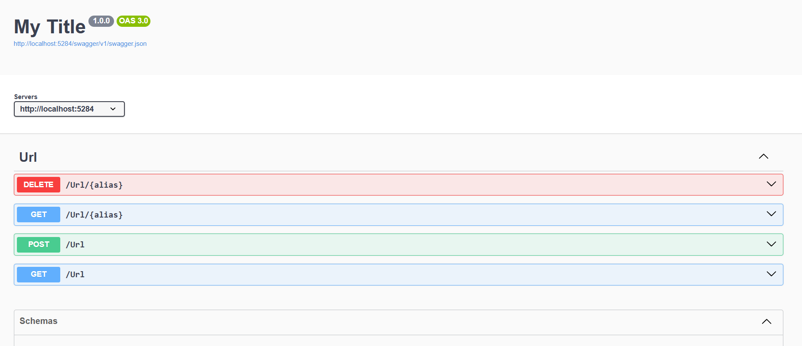
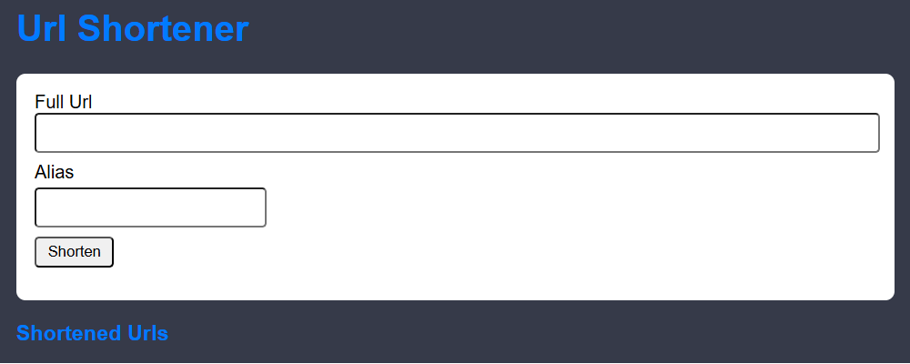
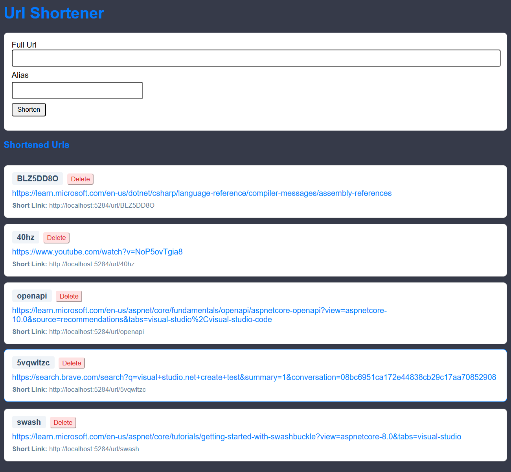

# URL Shortener Coding Exercise

## Getting Started Locally

1. Copy code to a local folder to test the project in.  
   for this example lets call the folder `C:\tpx-assignment`.
   for the rest of the instructions I'll refer to this as the download folder 	
1. for this demonstration, we'll be using Terminal to navigate and run this project	
   Open the download folder in the terminal and display the contents of that folder
   in the download folder you'll now see 4 additional files 
   - `UrlShortener` directory
	- `.gitIgnore` file
	- `openapi.yaml` file
	- `README.md` - this file

### Backend

1. navigate into the `UrlShortener` directory - `tpx-assignment\UrlShortener` 		
1. within that folder you'll now see the following 
   - `react-url-shortener` directory - react project
   - `UrlShortener` directory - .Net project
   - `UrlShortener.Tests` directory - .Net test project
   - `UrlShortener.slnx` file - solution for .Net projects
   navigate into the `UrlShortener` directory - `tpx-assignment\UrlShortener\UrlShortener`
1. In this directory, make sure you have a database.db in project
	1. if not, run `Python create_db.py` to create database for project
1. to run the project type `dotnet run` in the terminal
   the project should now be running on `http://localhost:5284`
1. in a browser, navigate to `http://localhost:5284/swagger` and you should see the following   
   
1. this indicates that backend is running in this instance of the terminal
   - keep this instance of the terminal running to allow the frontend to use this backend    
   - The Swagger interface should allow you to Shorten, Get and delete urls from the backend

### frontend

1. Open a new instance of the term from the download folder and navigate into the `UrlShortener` directory - `tpx-assignment\UrlShortener`
1. within that folder you'll now see the following 
   - `react-url-shortener` directory - react project
   - `UrlShortener` directory - .Net project
   - `UrlShortener.Tests` directory - .Net test project
   - `UrlShortener.slnx` file - solution for .Net projects
   navigate into the `react-url-shortener` directory - `tpx-assignment\UrlShortener\react-url-shortener`
1. run `npm install` to create the `node_modules` directory
1. run `npm start` to run frontend
1. if the code hasn't done so already, in a browser navigate to `http://localhost:8080` and you should see the following 
   
1. To Shorten a Url, add it to the `Full Url` field and click shorten
   this is the output of that action
   
   the following can be seen as url records retained by the app
   - Full Url in blue is a link that can be used
   - Short code sits above the Full Url and is unique to each shortened url
   - Delete button sits to the right of the shortcode
      - Confirmation will be required before the app will delete any shortened url
   - Short Url sits below the full url and can be copied into a browser, while the backend is running 

### running example

## [Licence](https://creativecommons.org/licenses/by-nc/4.0/)

Licence | [Creative Commons Attribution-NonCommercial](https://creativecommons.org/licenses/by-nc/4.0/)
|---|---|
Title of work | Url Shortener
Creator of work | Olaf Gallagher
Link to work | https://github.com/Thundter/tpx-impact-code-exercise-dot-net
Link to Creator Profile | https://github.com/Thundter
Year of creation | 2026

## todos

~~__todo__ - BUG - alias not yet working~~

~~__todo__ - front end tests~~

~~__todo__ - quality checking~~

~~__todo__ - front end currently untested~~ 

~~__todo__ - user guide~~

~~__todo__ - examples~~

~~__todo__ - licence~~

__todo__ - docker testings - WSL issue and licencing causing errors, have had to postpone this until I have a viable solution

## notes

### .Net 10 & NSwag incompatability

- installing the latest on the both of these causes many packages to auto downgrade, which in turn causes the update to fail
- documentation for using both together is currently incomplete as .Net 10 is less that 2 months old
- using both required and downgrade of .Net. Decided to use version 8.0

#### Swashbuckle.AspNetCore.Annotations 

- this call was made to install `dotnet add package Swashbuckle.AspNetCore.Annotations --version 6.6.2` 
- do not upgrade to version 10.1.4 as it causes the update to fail
- do not use M$'s own replacement for Swashbuckle as it doesn't work well yet

## Task

Build a simple **URL shortener** in .Net and React

It should:

~~+ Accept a full URL and return a shortened URL.~~

~~+ A shortened URL should have a randomly generated alias.~~

~~+ Allow a user to **customise the shortened URL** if they want to (e.g. user provides `my-custom-alias` instead of a random string).~~

~~+ Persist the shortened URLs across restarts.~~

~~+ Expose a **decoupled web frontend built using React** that demonstrates interaction with the API. The frontend does not need to be visually complex, but should clearly show your approach to **frontend structure, state handling, and user interaction**. You may use supporting frameworks or libraries (e.g. Next.js, Material-UI, Tailwind CSS, GOV.UK Design System, etc.) to speed up development if you wish.~~

~~+ Expose a **RESTful API** to perform create/read/delete operations on URLs.~~  
  ~~→ Refer to the provided [`openapi.yaml`](./openapi.yaml) for API structure and expected behaviour.~~

~~+ Include the ability to **delete a shortened URL** via the API.~~

~~- **Have tests**.~~

- Be containerised (e.g. Docker).
~~- Include instructions for running locally.~~

## Rules

~~+ Fork the repository and work in your fork. Do not push directly to the main repository.~~
~~- There is no time limit, we want to see something you are proud of. We would like to understand roughly how long you spent on it though.~~

~~+ **Commit often with meaningful messages.**~~

~~- Write tests.~~

~~+ The API should validate inputs and handle errors gracefully.~~

~~- The Frontend should show errors from the API appropriately.~~

~~+ Use the provided [`openapi.yaml`](./openapi.yaml) as the API contract.~~

~~+ Focus on clean, maintainable code.~~

~~+ AI tools (e.g., GitHub Copilot, ChatGPT) are allowed, but please **do not** copy-paste large chunks of code. Use them as assistants, not as a replacement for your own work. We will be asking.~~

## Deliverables

~~+ Working software.~~

~~+ Decoupled web frontend using React.~~

~~+ RESTful API matching the OpenAPI spec.~~

~~- Tests.~~

~~+ A git commit history that shows your thought process.~~

- Dockerfile.

~~- README with:~~

  ~~- How to build and run locally.~~

  ~~- Example usage (frontend and API).~~

  ~~- Any notes or assumptions.~~
